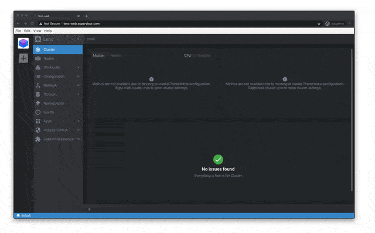

# lens-web

[https://github.com/lensapp/lens](https://github.com/lensapp/lens) for browser sponsored by [https://www.supervisor.com](https://www.supervisor.com)

Why: It's useful to have a shared Lens without having to distribute kubeconfigs among developers etc.

## run locally

Simply

    $ docker run -it --volume $HOME/.kube/config:/root/.kube/config -p 8080:8080 supervisorcom/lens-web

And open http://localhost:8080

## deploy to kubernetes / heroku

Somebody should make a PR with YAMLs & Helm chart etc.

## help this project

See [https://github.com/supervisor-com/lens-web/issues](https://github.com/supervisor-com/lens-web/issues)
